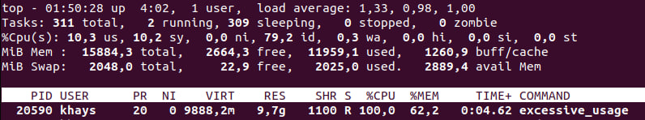
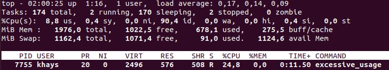

# Cgroups

## Review
`Control Groups`, commonly known as `cgroups`, is a Linux kernel feature that provides resource management and allocation capabilities. It allows you to control and limit system resources such as `CPU`, `memory`, `disk I/O`, and `network bandwidth` for a group of processes or tasks. `Cgroups` allows you to create hierarchies of processes and associate them with specific resource limits and usage policies. By doing so, you can ensure that resources are fairly distributed among different processes or groups of processes, preventing one process from monopolizing the system resources.

`Cgroups` can be used for various purposes, including process isolation, workload prioritization, and resource allocation in containerization technologies like Docker and Kubernetes. `Cgroups` can be used as part of a Linux sandboxing solution. While `cgroups` primarily focus on resource management and allocation, they can contribute to the overall isolation and confinement of processes or applications.

By utilizing `cgroups`, you can allocate specific resource limits to a group of processes, ensuring that they do not consume excessive `CPU`, `memory`, or other system resources. In the context of sandboxing, cgroups can be used alongside other mechanisms such as Linux namespaces or security modules like SELinux or AppArmor to create a more comprehensive sandbox environment. 

## Demonstration

We implemented simple program `excessive_usage.c` which will try to consume excessive CPU and memory so we can test `cgroups` on this program.
```
    while (1) {
        void* memory_block = malloc(MEMORY_BLOCK_SIZE);
        memset(memory_block, 0, MEMORY_BLOCK_SIZE);
    }
```
We should execute our program in the primary environment first to evaluate its impact on the system.



Based on the screenshot taken before the system froze, it is apparent that the program was utilizing `100%` of the `CPU` and `62%` of the available `memory`. To address this issue, we will now attempt to restrict the program's access to system resources by using cgroups. Let's begin by limiting the CPU usage.

```
sudo mkdir /sys/fs/cgroup/cpu/sandbox
sudo sh -c "echo 250000 > /sys/fs/cgroup/cpu/sandbox/cpu.cfs_quota_us"
sudo sh -c "echo 1000000 > /sys/fs/cgroup/cpu/sandbox/cpu.cfs_period_us"
sudo sh -c "echo PID > /sys/fs/cgroup/cpu/sandbox/tasks"
```

These commands allow us to establish a maximum `CPU` consumption limit of `25%`. It is essential to specify the Process ID (PID) of the target process that requires restriction. Once the program is executed, we can observe that it is restricted to utilizing a maximum of `25%` of the CPU's capacity.



Once memory limits are established, the program will be terminated when it exceeds the defined limit. This termination occurs in accordance with the predetermined out-of-memory (OOM) killer policy.

```
sudo mkdir /sys/fs/cgroup/memory/sandbox
sudo sh -c "echo 100000000 > /sys/fs/cgroup/memory/sandbox/memory.limit_in_bytes"
sudo sh -c "echo 0 > /sys/fs/cgroup/memory/sandbox/memory.swappiness"
sudo sh -c "echo PID > /sys/fs/cgroup/memory/sandbox/tasks"
```

These commands enable us to establish a `memory` consumption limit of `100MB` and disable `memory swappiness` using cgroups. Additionally, it is necessary to specify the Process ID (PID) of the target process that requires restriction. By executing these commands, the program's memory usage will be constrained to a maximum of `100MB`, and the system's swappiness behavior will be disabled.

## Performance 

When measuring the performance of the mechanism, we employed a specific methodology. We conducted measurements to assess the overhead both with and without applying the mechanism. The purpose was to evaluate the impact on system performance and gauge the effectiveness of the mechanism in managing resources. The measurement results provided valuable insights into the performance implications associated with the utilization of cgroups.

## Conclusion

Cgroups offer a significant performance advantage when utilized as a sandboxing mechanism. Their ability to finely manage and allocate resources allows administrators to set specific resource limits for processes or process groups. This level of control ensures that resource-intensive applications do not overly impact overall system performance. However, it is crucial to configure cgroups correctly to avoid overly restrictive resource limits that could potentially affect legitimate processes. Thus, careful tuning and monitoring of cgroup settings are essential to maintain a balance between resource allocation and system performance in a sandboxing environment. Cgroups, on their own, do not directly provide access control for some system components for example file access. However, they can be effectively combined with security modules like AppArmor or SELinux to enhance the overall security of the system.


